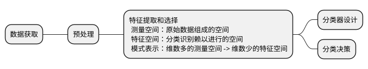

## 模式识别

### 基础知识

1. 模式识别技术，机器学习理论，数学原理。
2. 模式：
   - 从事物获取的信息（往往具有时间和空间分布信息）
   - 广义来说，可以区分是否相同或相似的时间和空间中可观察的物体都可以称为模式。
   - 数据中具有一定特点的目标、行为、事件。
3. 模式特性：可观察性、相似性、可区分性。
4. 类别：具有相似特点的模式组成类别。
5. 样本/样例：单个模式。
6. 模式识别：通过计算机用数学方法来研究模式的自动处理和判读。
7. 模式识别目的：利用计算机对物理对象进行分类，在错误概率最小的条件下，使识别结果尽量与客观物体相符合。
8. $Y=F(X)$
   > $X$ 定义域 取自特征集
   > $F$ 模式识别的判别方法
   > $Y$ 值域 类别的标号集
9. 模式识别系统的目标：在<b>特征空间</b>和<b>解释空间</b>找到一种<b>映射关系</b>（假说）。
10. 特征空间：从模式得到的对分类有用的度量、属性或基元构成的空间。
11. 解释空间：将$c$个类别表示为$w_i\subset\Omega,i=1,2,3,...,c$，其中$\Omega$为所属类别的集合，称为解释空间。

12. 监督学习/概念驱动/归纳假说：在<b>特征空间</b>中找到一个与<b>解释空间</b>的结构相对应的假说。（给定模式下假定一个解决方案，在训练集和未知集中都要接近结果；用训练集<b>特征向量的分布</b>确定假说，还要有足够的<b>先验知识</b>）
13. 非监督学习/数据驱动/演绎假说：在<b>解释空间</b>中找到一个与<b>特征空间</b>的结构相对应的假说（只以特征空间中的相似关系为基础）。[聚类 <b>无先验知识</b>]
14. 主要方法：
    - 数据聚类
    - 统计分类
    - 结构模式识别
    - 神经网络
 

15. 模式识别系统

17. 模式识别和机器学习的关系
    - 机器学习（理论）成长于计算机科学
    - 模式识别（技术）源于工程，具有更多的系统特性
    - 机器学习在模式识别中很重要 你中有我 我中有你
    - 模式识别研究的是怎么样通过输入的特征对样本进行分类。
    - 机器学习更加关注的是如何通过输入的样本来提取出合适的特征，进而实现分类的目标。

18. 模式识别和计算机视觉的关系
    - 计算机视觉包含多视几何、三维重建等
    - 模式识别包含音频、文本、雷达以及各类传感器的数据
    - 在面向图像/视频分类的研究应用中有较多重合，有相似之处，由各有特色
