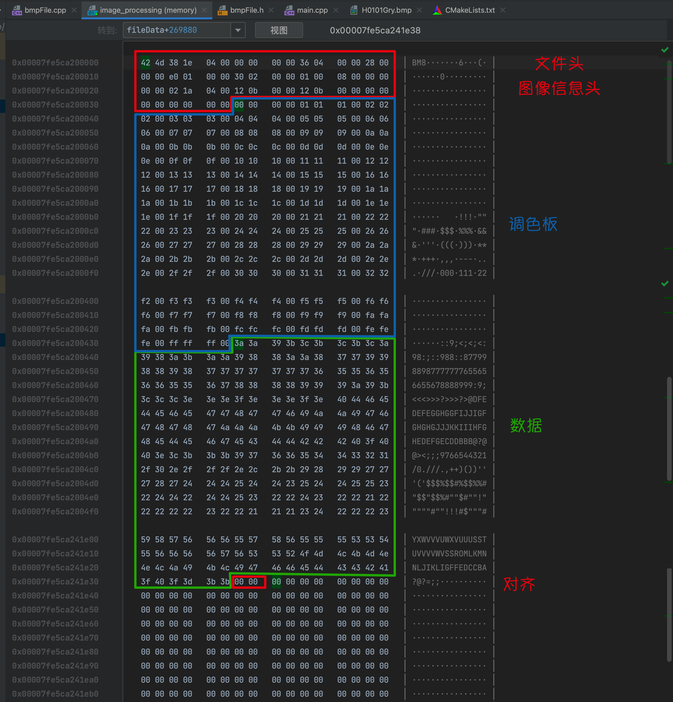

1. bmp图像 每行要求4个字节对齐（是对于文件而言）
2. bmp文件头：包含了图像类型、图像大小、图像数据存放地址和两个保留未使用的字段。
3. 位图信息头：包含了位图信息头的大小、图像的宽高、图像的色深、压缩说明图像数据的大小和其他一些参数。
4. 调色板：单色、16色和256色图像文件所特有的，相对应的调色板大小是2、16和256，调色板以4字节为单位，每4个字节存放一个颜色值，图像的数据是指向调色板的索引。
5. 位图数据：如果图像是单色、16色和256色，则紧跟着调色板的是位图数据，位图数据是指向调色板的索引序号。如果位图是16位、24位和32位色，则图像文件中不保留调色板，即不存在调色板，图像的颜色直接在位图数据中给出。

具体见图：
