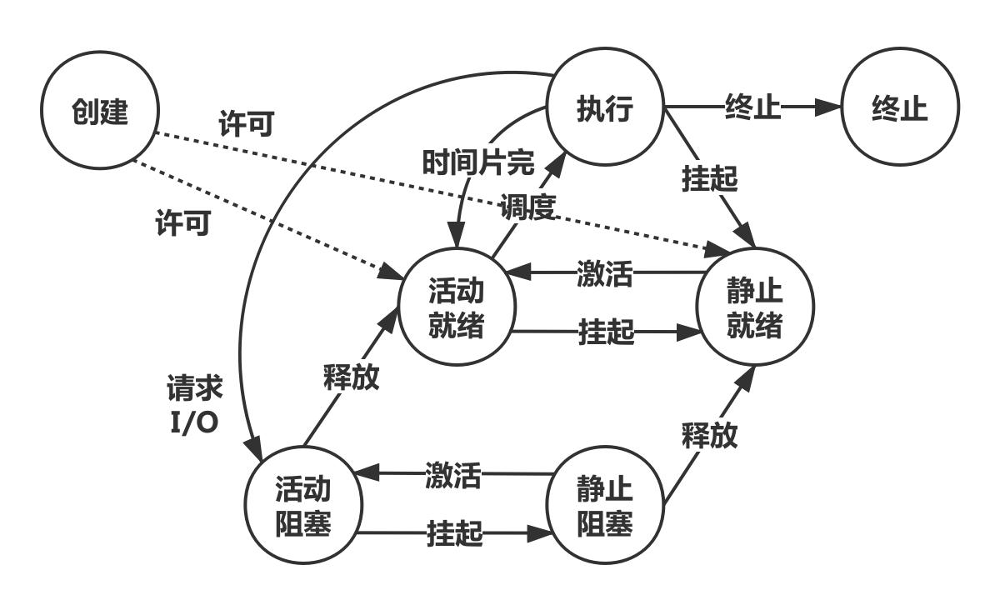
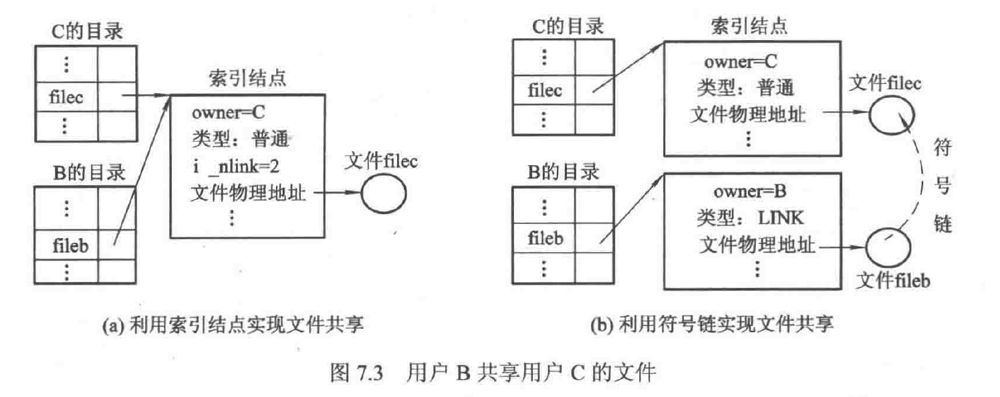
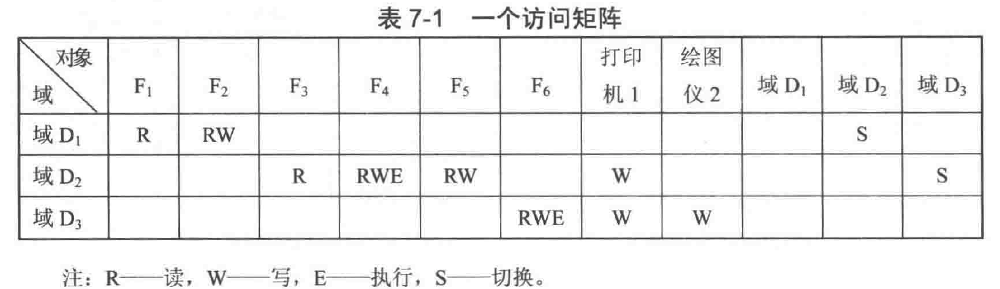

### 相关概念
1. 操作系统的目标和作用
   - 定义：是一组控制和管理计算机硬件和软件资源，合理对各类作业进行调度，以及方便用户使用计算机的**程序的集合**。
   - 目标：方便性、有效性、可扩充性、开放性
   - 作用：人机接口、资源管理者、对资源抽象、工作流程组织者

2. 操作系统的发展过程
   - 无操作系统的计算机系统
     1. 人工操作方式
     2. 脱机输入/输出方式
   - 单道批处理系统
   - 多道批处理系统
     1. 多道程序设计技术
     2. 多道批处理系统
   - 分时系统
     1. 特性：多路性、独立性、及时性、交互性
   - 实时系统
     1. 类型：硬实时、软实时
     2. 特性（与分时比较）：多路性、独立性、及时性、交互性、**可靠性**
   - 微机操作系统

3. 操作系统的基本特征（**4者关系**）
   - 并**发**性
   - 共享性：互斥共享、同时访问
   - 虚拟性
   - 异步性

4. 操作系统的功能
   - 处理机管理：进程控制、进程同步、进程通信、进程调度
   - 储存器管理：内存分配、内存保护、地址映射、内存扩充
   - 设备管理：缓冲管理、设备分配、设备处理
   - 文件管理：文件储存空间的管理、目录管理、文件读/写管理和保护
   - 友好的用户接口：用户接口、程序接口
   - 现代操作系统的新功能：系统安全、网络的功能和服务、支持多媒体

5. 操作系统的结构
   - 无结构OS
   - 模块化结构OS
   - 分层式结构OS
   - 微内核结构OS 

---
### 进程管理
1. 基本概念
   - 前趋图
   - 程序的顺序执行：顺序性、封闭性、可再现性
   - 程序的并发执行：间断性、失去封闭性、不可再现性
   - 进程的定义：进程是进程实体的运行过程，是系统进行资源分配和调度的一个独立单位。
   - 进程的特征：动态性、并发性、独立性、异步性
   - 进程的状态
     1. 基本状态：就绪、阻塞、执行
     2. 进程挂起：（活动/静止）就绪、（活动/静止）阻塞、执行
   - 进程控制块（PCB）：进程标识符、处理机状态、进程调度信息、进程控制信息
   

2. 进程控制：系统内核通过原语实现
   - 操作系统的内核：系统态、用户态
   - 进程的创建
   - 进程的终止
   - 进程的阻塞和唤醒
   - 进程的挂起与激活
3. 进程同步：使得进程具有可再现性质
   - 概念
     1. 两种制约关系：直接相互制约、间接相互制约
     2. 临界资源和临界区
     3. 同步机制应遵循的规则：空闲让进、忙则等待、有限等待、让权等待
   - 信号量机制：整型信号量（不遵循让权等待）、记录型信号量
   - 信号量的应用：实现前趋关系、实现互斥
4. 经典进程的同步问题
   - 生产者消费者问题（直接制约）
   - 哲学家进餐问题（间接制约）
   - 读者—写者问题
5. 管程机制
   - 定义：是由一组局部的共享变量、对局部变量进行操作的一组过程构成的一个软件模块
   - 特点
     1. 局部共享变量只能被管程内的过程访问
     2. 任何进程只能通过管程的入口进入
     3. 任一时刻，最多只有一个进程在管程中执行
     4. 需要编译器的支持
6. 进程通信
   - 通信的类型：共享存储器系统、管道通信、消息传递系统、客户机-服务器系统(套接字、远程过程调用、远程方法调用)
   - 消息缓冲队列通信机制
7. 线程
   - 概念：进程是拥有资源的实体，线程是一个可执行的实体，cpu调度和分配的基本单位是线程，线程基本上不拥有资源。
   - 线程的控制
   - 线程的实现
     1. 用户级线程：对内核而言为一个进程一个单线程，线程的控制在用户空间中
     2. 内核支持线程：为每个线程分配TCB，切换慢
     3. 组合方式：多对1、1对1、多对多(好)

---
### 处理机调度与死锁
1. 基本概念
   - 处理机调度的层次
     1. 高级调度（作业调度/长程调度）
     2. 中级调度（内存调度/中程调度）
     3. 低级调度（进程调度/短程调度）
        - 非抢占式：简单、开销小
        - 抢占式：优先权原则、短作业优先原则、时间片原则
   - 处理机调度目标：吞吐量大、利用率高、资源平衡利用、不同作业公平性
   - 批处理系统的重要指标：
	$T_{si}$CPU执行时间、${T_i}$提交到完成的时间
     1. 平均周转时间：$\frac{1}{n}\sum^{n}_{i=1}{T_i}$
     2. 平均带权周转时间：$\frac{1}{n}\sum^{n}_{i=1}\frac{T_i}{T_{si}}$
2. 调度算法
   - 先来先服务（FCFS）：非抢占
   - 短作业优先（SJF）：抢占
   - 优先级调度算法（PSA,Priority Scheduling Algorithm）：抢占
     1. 静态优先权
     2. 动态优先权
   - 高响应比优先调度算法（HRRN,Highest Response Ratio Next）计算时理解为**非抢占式**
      $响应比=\frac{响应时间}{要求服务时间}=\frac{等待时间+要求服务时间}{要求服务时间}$
   - 时间片轮转法（RR,Round-Robin）：抢占
   - 多级队列调度算法：队列间使用**固定优先级的抢占**，队列内随意
   - 多级反馈队列调度算法（FB,Multilevel Feedback Queue Scheduling）：linux在用，**抢占**，每个队列不一样的时间片，最后一个队列使用**时间片轮转**RR
3. 实时调度
   - 基本条件：保证实时任务对截止时间的要求
   - 方式和算法的选择
     1. 小型系统：非抢占式轮转调度 数秒—数十秒响应时间
     2. 一定要求的实时系统：非抢占式优先权调度 数秒—数百毫秒
     3. 严格要求的实时系统：立即抢占优先权调度 几微秒—100微秒
   - 常用的实时调度算法
     1. 最早截止时间优先（EDF,Earliest DeadlineFirst）
     2. 最低松弛度优先（LLF,Least Laxity First）
     （$松弛度=任务必须完成的时间-任务本身的运行时间-当前时间$） 松弛度越低 优先级越高
   - 优先级倒置（程序进入临界区）
4. 死锁
   - 定义：一个进程集合中每一个进程都在等待只能由该集合中的其他进程才能引发的事件，那么该组进程进入死锁状态
   - 产生的原因：资源竞争、进程推进顺序非法
   - 产生死锁必要条件：互斥条件、请求和保持、不剥夺、环路等待
5. 处理死锁
   - 预防死锁：可以破坏后三个，第一个（互斥条件）为固有特性
     1. 摒弃“请求和保持”：进程一次性申请运行所需全部资源
     2. 摒弃“不剥夺”：A提出新的资源要求不能得到满足则立即释放A已获得的全部资源。
     3. 摒弃“环路等待”：对资源赋予序号，规定申请资源的顺序
   - 避免死锁：施加的限制弱，获得满意的性能
     1. 安全与不安全状态：按照某种进程顺序分配资源能否顺利完成任务。安全状态对应的进程顺序为安全序列。
     2. 用**银行家算法**进行避免，需要用到安全性算法
     3. **安全性算法**
   - 死锁的检测与解除
     1. 资源分配图：进程和资源的申请和分配关系的有向图
     2. 死锁定理：对资源分配图进行简化来预测是否为死锁；S状态的资源分配图不可完全简化称为死锁定理
     3. 死锁的检测算法
     4. 死锁的解除：剥夺资源（从其他进程剥夺给死锁进程）、撤销进程（撤销死锁进程）

---
### 储存器管理
1. 基本概念
   - 储存器的层次结构
   - 程序执行：编译 链接 装入
   - 程序的链接：形成完整的装入模块
     1. 静态链接方式
     2. 装入时动态链接
     3. 运行时动态链接
   - 程序的装入
     1. 绝对装入方式
     2. 可重定位装入方式与静态重定位
     3. 动态运行装入方式
2. 内存连续分配方式
   - 单一连续分配：一个作业、单用户、单进程
   - 固定分区分配：一个分区对应一道作业
   - 动态分区分配
     1. 首次适应算法
     2. 循环首次适应算法
     3. 最佳适应算法
     4. 最坏适应算法
   - 伙伴系统：固定/动态分区 折中
   - 可重定位分区分配：动态分区+紧凑
   - 分区的保护：界限寄存器 或 保护键
   - 对换：整体对换/进程对换 部分对换/页面对换/分段对换
     1. 对换空间的管理
     2. 进程的换出
     3. 进程的换入
3. 内存基本分页式储存管理方式
   - 分页储存管理的基本方法：页表、页号和位移量
   - 地址变换机构
     1. 基本的地址变换机构
     2. 具有快表的地址变换机构
     3. 多级页表
4. 内存分段式储存管理方式
   - 数据共享与保护、分段动态增长
   - 分段与分页的比较
     1. 页是物理单位（提高内存利用率），段是逻辑单位（有相关意义，方便用户）
     2. 页的大小由系统决定，段的长度不定（由用户程序决定）
     3. 分页是一维的，只需要给出一个地址；段需要给出段名和地址。
     4. 页式存储是一维的，段式存储是二维的，段页式存储也是二维的。 
   - 段页式储存管理方式：用户程序分为段，段再分为页
5. 信息的共享
   - 分页和分段共享的差异，分段更方便

---
### 虚拟存储器
1. 基本概念
   - 常规储存管理方式的特征：一次性、驻留性
   - 程序执行局部性原理：时间局部性、空间局部性
   - 定义：具有调入、置换功能，能从逻辑上对内存容量加以扩充的存储器系统
   - 特征：多次性、对换性、虚拟性
2. 请求分页存储管理方式
   - 基本原理：装入部分作业，页表字段（内存块号、~~存取访问（权限）~~、**状态位P、访问字段A、修改位M、外存地址**）
   - 内存分配策略和置换策略
     1. 固定分配 局部置换
     2. 可变分配 局部置换
     3. 可变分配 全局置换
   - 调页策略：请求调页策略、预调页策略
3. 页面置换算法
   - 最佳置换算法（OPT,OPTimal replacement）：常用来评价其他算法
   - 先进先出置换算法（FIFO）
   - 最少使用算法（LFU）
   - 页面缓冲算法：置换页面留在内存中
   - **最近最久未使用（LRU,Least recently used）**
   - clock算法、改进clock算法（都近似LRU）
4. 请求分段式存储管理方式
   - 基本原理：装入部分作业，字段（增加：状态位P、访问字段A、修改位M、外存地址）
   - 分段的共享：共享段表
   - 分段的保护：越界检查、存取控制检查、环保护机制

---
### 输入输出系统
1. I/O系统的基本功能和层次结构
   - 基本功能
     1. 隐藏物理设备的细节：统一少量读写命令
     2. 与设备的无关性：抽象设备逻辑名
     3. 提高处理机和I/O设备的利用率：减少处理机干预
     4. 对I/O设备进行控制：对传输数据、方式进行控制
     5. 确保对设备的正确共享：分配方式
     6. 错误处理
   - 层次结构
     1. 用户层I/O软件：调用库函数操作设备
     2. 设备独立性软件：统一接口、设备命名、设备保护/释放、提供数据传送空间
     3. 设备驱动软件：辑盘块号转换为物理地址
     4. 中断处理程序：用于完成I/O操作后进行处理
2. I/O硬件
   - I/O设备
     1. 按信息交换的单位分：块设备（磁盘）、字符设备（终端）
     2. 按使用特性分：存储设备、I/O设备
     3. 按传输速率分：低速（键盘）、中速（打印机）、高速（磁盘）
   - 设备控制器：CPU与I/O设备的硬件接口，用寄存器传输数据
   - I/O寄存器的访问方式：分配I/O端口、内存映射I/O
   - I/O通道：局限于I/O操作指令，有自己的控制总线，共享主机内存，减少CPU干预
   - 中断：外部中断、陷入（异常）
3. 中断处理程序和设备驱动程序
   - 中断处理：I/O完成，发送中断信号
     1. 检查本次I/O操作的完成情况
     2. 进行I/O结束或错误处理
     3. 唤醒被I/O操作阻塞的进程
     4. 启动下一个请求
     5. 中断返回
   - 设备驱动：接收指令，传送数据
     1. 将抽象要求转化为具体要求
     2. 检查I/O的合法性
     3. 读出和检查设备状态
     4. 传送必要参数
     5. 启动I/O设备
   - I/O控制方式
     1. 轮询方式：CPU不断测试I/O是否完成
     2. 中断方式：I/O完成后（输入缓冲寄存器），设备控制器向CPU发送I/O中断
     3. 直接存储器访问方式（DMA）：DMA控制输入设备不断挪用CPU，把数据通过DMA数据寄存器传到指定内存位置，完成后发送中断
     4. I/O通道控制方式：CPU给出执行的通道程序起始地址和访问I/O设备，完成后发送中断；把一个数据块的读写 -> **一组**数据块的读写
4. 与设备无关的I/O软件
   - 设备无关性：设备独立性，使用*逻辑设备*名称来请求某类设备，执行依然需要物理设备，建立**逻辑设备表（LUT）**
   - **设备独立性软件**：设备驱动与硬件紧密相关，所以用设备无关的I/O软件向用户层提供统一接口
   - 设备分配
     1. 设备分配的数据结构：设备控制表（DCT）、控制器控制表（COCT）、通道控制表（CHCT）、系统设备表（SDT）
     2. 独占设备的分配程序：用SDT找到DCT，分配成功则用DCT找到COCT，COCT不忙则找CHCT。只有在设备、控制器、通道三者都分配成功才传输数据。
   - 缓冲管理：缓冲区
5. 用户层I/O软件
   - I/O库函数
   - 假脱机（SPOOLing）系统：利用多道程序中的一两道程序模拟脱机输入输出中的外围控制机的功能
     1. SPOOLing系统组成：输入输出井（磁盘中大储存空间）、输入输出缓冲区（内存中缓冲区）、输入输出进程、井管理程序。
     2. SPOOLing技术改造打印机系统
6. 磁盘调度
   - 简述：盘片、储存面、磁道、扇区；固定头磁盘/移动头磁盘；$访问时间=寻道时间+旋转延迟时间+数据传输时间$
   - 磁盘调度：决定服务进程顺序，使得磁盘平均寻道时间更短
     1. 先来先服务（FCFS）
     2. 最短寻道时间优先（SSTF）
     3. 扫描（SCAN）
     4. 循环扫描（CSCAN）：只处理移动的某一个方向
     5. N-step-SCAN算法：将磁盘请求分为若干长度为N的子队列，FCFS处理队列，在用SCAN处理每个队列里面数据
     6. FSCAN：简化N-step-SCAN，分为两个队列，目前队列和新到达的队列。

---
### 文件管理
1. 文件和文件系统
   - 文件的定义：具有文件名的一组相关信息的集合。文件包含文件名、基本内容、属性
   - 文件系统：操作系统中与文件管理有关的那部分软件和他们管理的文件和文件属性的集合。
     1. 对象及其属性：文件、目录、文件储存器
     2. 对对象操纵和管理的软件集合：储存空间管理、目录管理、逻辑地址->物理地址、文件读写、共享和保护等
     3. 文件系统接口：命令接口、程序接口、图形用户接口
   - 文件的使用
     1. 创建文件：分配空间，建立目录项
     2. 删除文件：找到目录项，回收空间，释放目录项
     3. 读文件：通过文件目录项文件在外存物理地址的信息读取
     4. 写文件
     5. 设置文件读/写指针：距离文件首字节的偏移量，随机访问
     6. 打开文件：将指定文件的属性信息复制到内存
     7. 关闭文件：从内存中删除文件的属性信息，若被修改则需写回
2. 文件的逻辑结构
   - 有结构文件：记录式文件
     1. 数据组成：
        - 数据项：描述一个个体的某种属性（最低级）
        - 记录（定长/变长）：描述一个个体某方面的属性（多个数据项，可以用一个或多个数据项唯一标识一个记录->**关键字**）
        - 文件：描述了一个对象集合（多个记录的有序集合）
     2. 逻辑组织：
        - 顺序文件
        串结构文件：按照**记录**存入的先后次序排列
        顺序结构文件：按照**关键字**的次序进行排序
        - 索引文件：**记录**为可变长度，建立索引表，每个**记录**的记录号（或者**关键字**）、长度、逻辑地址
        - 索引顺序文件：建立索引表，为主文件的**每一组**记录的**第一个**记录设置索引表项
   - 无结构文件：字符流构成，流式文件
3. 文件目录
   - 文件控制块、目录项、索引节点
     1. **文件控制块（FCB）**：基本内容：文件名、文件物理地址；其他内容：文件的逻辑结构、物理结构、长度、存取权限、建立日期和时间、最后一次修改日期和时间、文件的连接计数、文件的主标识符等
     2. 目录：FCB与文件一一对应，FCB的有序集合；每个FCB为目录项。目录通常以文件形式存放在外存，称为目录文件
     3. 索引节点：目录项仅有文件名和指向该文件对应的索引节点的指针
     4. **索引节点（I-node）**：文件主标识、文件类型、文件存取权限、文件物理地址、文件长度、文件链接计数、文件存取时间
   - 目录结构
     1. 单级目录结构：不允许文件重名，不利于文件共享
     2. 两级目录结构：每个用户一个目录
     3. 多级目录结构
   - 目录查询技术
4. 文件共享
   - 基于索引节点的共享：硬链接
   - 利用符号链接的共享：软链接 特殊文件

5. 文件保护
   - 影响文件安全主要因素：人为、系统、自然
   - 访问权和保护域
     1. 访问权：一个进程对**某个**对象执行操作的权利，有序对(对象名,权集)
     2. 保护域：一组进程对**一组**对象的访问权的集合
     3. 进程只能在一个域中运行，进程可以切换自己的域
   - 访问矩阵
   

   - 访问矩阵的实现
     1. **访问控制表**：将访问矩阵按**列**（对象）进行划分，每个列建立一张访问控制表，存在FCB
     2. **访问权限表**：将访问矩阵按**行**（域）进行划分，每个行建立一张访问权限表

---
### 磁盘存储器的管理
1. 外存的组织方式
   - 连续组织方式：连续分配方式；物理结构：顺序结构；物理文件：顺序文件
   - 链式组织方式：离散分配方式
     1. 隐式链接：首块物理地址在FCB中，前一块存后一块地址；只支持顺序访问
     2. **显式链接**：各个物理块指针显式登记在系统的一张文件分配表FAT中；容量问题
   - 索引组织方式：每个文件建立索引块（表），FCB存指向索引表指针，可能多级索引
   - **混合索引方式**：直接地址、一次间址、多次间址
   - NTFS的文件组织方式
2. 文件存储空间的管理
   - 空闲表法：连续分配；空闲表记录文件储存空间，回收涉及空闲区的合并
   - 空闲链表法：离散分配；空闲区成链，链接指针和盘块数目登记在空闲盘块中，增加减少分区需要大量I/O
   - 位示图法：二维图，一位(0/1)表示盘块空闲/忙
   - 成组链接法：unix用；每一组的盘块号和盘块数记录在前一组的最后一个盘块中（栈底，图的最上面），第一组盘块数可以不满，最后一组最后一个盘块放0表示结束
3. 提高磁盘I/O速度的途径：磁盘高速缓存、提前读、延迟写、优化物理块布局、虚拟盘RAM实现（临时文件）、RAID（可靠性、并行读写）
4. 提高磁盘可靠性技术
   - 第一级容错技术SFT-I：磁盘表面错误；双份目录和双份文件分配表、热修复重定向、写后读校验
   - 第二级容错技术SFT-II：磁盘驱动器错误；磁盘镜像、磁盘双工
   - 基于集群技术的容错功能：双机热备份模式、双机互为备份模式、公用磁盘模式
   - 后备系统
5. 数据一致性控制：事物、重要数据一致性检查（盘块一致性、链接计数一致性）
